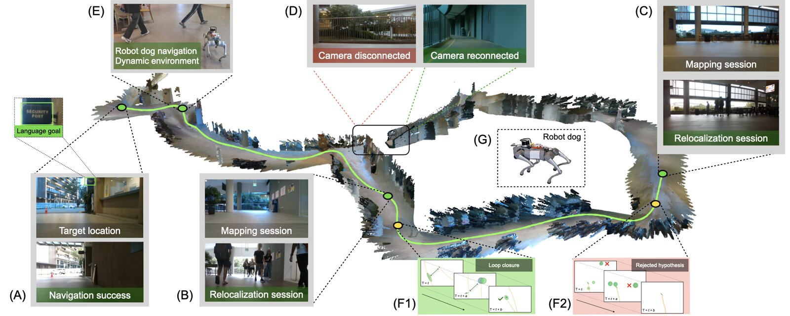

<div align="center">

# CROSS: Change-Robust Online Topological Memory for Long-Term Relocalization and Semantic Navigation

### NeurIPS 2026

Jiaming Wang, Jizhuo Chen, Diwen Liu, Atharva Ghotavadekar, Jiaxuan Da, Linh Kästner, Harold Soh

National University of Singapore

[](https://jiaming.im/CROSS/)
[](https://arxiv.org/abs/2605.02227)

[](LICENSE)

<a href="https://jiaming.im/CROSS/"></a>

</div>

**Pose-aware topological mapping for RGB-D, stereo and monocular inputs.**

CROSS builds probabilistic topological maps from RGB-D or stereo camera streams. It maintains a Gaussian mixture belief over SE(3) poses, tracks multiple hypotheses, detects loop closures, and optimizes pose graphs — enabling robust long-term navigation in indoor environments.

Two modes share one back end (belief, hypotheses, verified loop closure, pose graph, retrieval):

| mode | relative pose estimator | input | install / run |
|---|---|---|---|
| **RGB-D** (default) | XFeat + LightGlue + PnP-RANSAC on keyframe depth | RGB-D (or RGB + predicted depth) + odometry | `bash install.sh`, `python run.py <seq>` |
| **stereo** | feed-forward multi-view model (VGGT-Omega, optionally Depth Anything 3); one forward pass registers the current view against all retrieved keyframes, the known stereo baseline fixes the metric scale | stereo pairs (or monocular + odometry) | `bash install.sh --stereo`, `python run.py <seq> --mode stereo` |

The stereo mode tolerates lighting, weather and viewpoint changes that break keypoint matching; it was developed as
CROSS-stereo and is merged here (see [Stereo mode](#stereo-mode)).

## Key Features

- **Multi-hypothesis tracking** — Gaussian mixture model (GMM) over SE(3) with evidence-driven lifecycle (birth, realization, removal).
- **Loop closure** — Overlap-based detection with asynchronous pose graph optimization (GTSAM) and hypothesis merging.
- **Topological planning** — Lightweight graph over keyframes with odometry and proximity edges; supports A\* and Dijkstra path planning.
- **Visual place recognition** — Keyframe database with embedding-based retrieval for relocalization.
- **Semantic memory** — Text-conditioned object search across the map using open-vocabulary detectors.
- **Verified loop closure** — prior, in-pass and posterior consistency tests at one chi-square level, with a noise model calibrated without ground truth from about a minute of the robot's own data.
- **Stereo mode** — learned multi-view relative poses with stereo scale anchors (see below).
- **Multiple dataset formats** — R3D, ROS bags, OpenLORIS, TUM RGB-D, posed RGB-D folders; stereo: KITTI raw, TartanAir V2, Virtual KITTI 2, SimChange.

## Architecture

```
cross/
├── core/           # System pipeline, hypothesis management, PGO, planning
├── cv/             # Pose estimation (PnP; stereo mode: feed-forward + stereo scale), feature extraction, detection
├── db/             # Keyframe database and visual place recognition
├── dataloader/     # Dataset loaders (R3D, ROS bag, OpenLORIS, TUM, posed RGB-D; stereo sequences)
├── utils/          # Math (Lie algebra, rotations), profiling, camera models
└── visualization/  # Rerun-based 3D visualization, graph plotting
```

## Installation

### Quick Start (recommended)

```bash
git clone https://github.com/jiaming-ai/CROSS.git
cd CROSS
bash install.sh
```

The install script handles everything: creates a virtual environment via [uv](https://docs.astral.sh/uv/), installs PyTorch with CUDA, installs CROSS and its dependencies, and builds GTSAM.

For the **stereo mode** add `--stereo` (installs the vendored VGGT-Omega and downloads its weights to
`models/VGGT-Omega/`; the checkpoint is gated: request access at [facebook/VGGT-Omega](https://huggingface.co/facebook/VGGT-Omega)
and `huggingface-cli login` first) and optionally `--da3` for the Depth Anything 3 backend:

```bash
bash install.sh --stereo          # RGB-D + stereo mode
bash install.sh --stereo --da3    # + Depth Anything 3 backend
```

<details>
<summary><strong>Install options</strong></summary>

```bash
# CPU-only (no CUDA)
bash install.sh --cpu

# Specific CUDA version, it should match the cuda version on your PC, i.e. nvcc --version
CUDA_VERSION=cu121 bash install.sh
```
</details>

### Manual Installation

```bash
# 1. Create and activate environment
uv venv --python 3.11
source .venv/bin/activate

# 2. Install PyTorch (match your CUDA version — check with nvcc --version)
uv pip install torch torchvision torchaudio --index-url https://download.pytorch.org/whl/cu124

# 3. Install CROSS
uv pip install -e ".[all]"

# 4. Install GTSAM (required for pose graph optimization)
git clone --depth 1 https://github.com/borglab/gtsam.git thirdparty/gtsam
cd thirdparty/gtsam
uv pip install -r python/dev_requirements.txt
mkdir -p build && cd build
cmake .. -DGTSAM_BUILD_PYTHON=1 -DGTSAM_PYTHON_VERSION=3.11 -GNinja
ninja python-install
cd ../../..
```

### Optional Dependencies

```bash
# Object detection (semantic memory)
uv pip install -e ".[detection]"

# R3D recording support
uv pip install -e ".[recording]"
```

## Usage

### Run mapping on a dataset

```bash
uv run python run.py data/r3d/lab2.r3d
```

Options:

| Flag | Description |
|------|-------------|
| `--no-viz` | Disable Rerun visualization |
| `--frames N` | Process only the first N frames |
| `--start N` | Start from frame N |
| `--mode {rgbd,stereo}` | Relative pose estimator: PnP on depth (default) or the stereo mode (layers `configs/stereo.yaml`) |
| `--loader {r3d,rosbag,loris,tum,posed,stereo}` | Force dataset loader (default: auto-detect) |
| `--baseline B` | Stereo mode, SimChange sequences: which rendered stereo baseline to use |
| `--snr FLOAT` | Signal-to-noise ratio for R3D datasets |
| `--async` | Enable async step pipeline |

### Interactive demo

```bash
python examples/demo.py
```

Provides a REPL with commands: `l` (load sequence), `s` (set start), `g` (go/run), `p` (plan path), `v` (visualize graph), `q` (quit).

### Multi-session mapping

```bash
uv run python examples/multi_session.py
```

### Save, load, and plan

```bash
uv run python examples/planner.py --map-scene data/r3d/lab_obj.r3d --reloc-scene data/rosbag/lab_office_dog
```

### Benchmark: mapping accuracy and relocalization success

Two harnesses build a map on one sequence and measure relocalization success on another (CROSS protocol: independent
100-frame trials that start without knowing the pose; a trial succeeds when its final estimate is within `--r-d` of the
pose the map implies, 2 m indoors), plus the keyframe ATE of the map:

- `scripts/map_and_reloc_rgbd.py`: RGB-D mode on posed RGB-D folders (`rgb/`, `depth/`, `poses_left.txt`, optional
  `odom_left.txt` with the robot's own odometry, `calib.json`);
- `scripts/map_and_reloc.py`: stereo sequences (SimChange, KITTI raw, TartanAir V2, Virtual KITTI 2) or posed RGB-D
  folders, with `--estimator ff` (stereo mode) or `--estimator pnp --pnp-depth gt|sgbm`.

```bash
# OpenLORIS-Scene (package format) -> posed RGB-D folders; the robot's wheel odometry is kept and used as odometry
python scripts/datasets/convert_openloris.py data/openloris/home1-1 data/posed/home1-1
python scripts/datasets/convert_openloris.py data/openloris/home1-2 data/posed/home1-2
python scripts/map_and_reloc_rgbd.py --map data/posed/home1-1 --query data/posed/home1-2 --out outputs/home
# the same in the stereo mode, monocular (metric scale from the wheel odometry and map keyframe pairs)
python scripts/map_and_reloc.py --map data/posed/home1-1 --query data/posed/home1-2 --out outputs/home_ff --estimator ff \
    --obs-min-translation 0.3 --obs-min-rotation 0.15 --obs-max-interval 3 \
    --set pose_est.ff.use_odom_anchor=true pose_est.ff.use_map_anchors=true pose_est.ff.n_ref_anchors=0 pose_est.ff.use_curr_anchor=false
# stereo mode on a SimChange scene (0.3 m baseline)
python scripts/map_and_reloc.py --map data/sim/hssd_house/map --query data/sim/hssd_house/light_night --out outputs/house_ff \
    --estimator ff --baseline 0.3 --snr 10 --obs-min-translation 0.3 --obs-min-rotation 0.15 --obs-max-interval 3 \
    --trial-len 100 --trial-stride 50 --noise-config configs/noise/hssd_house_600.yaml
# TUM RGB-D: scripts/datasets/convert_tum.py (simulated noisy odometry: --snr 10 --seed 0)
```

### Noise calibration for a new robot (optional)

The verified loop closure uses a noise model of the relative-pose estimator and the odometry.  The defaults work for
wheeled indoor robots; for another platform, record about a minute of data and calibrate without ground truth:

```bash
python scripts/map_and_reloc_rgbd.py --map <seq> --query <seq> --out outputs/calib --map-end 600 --skip-reloc --dump-graph
python scripts/lc/calibrate_noise.py --graph outputs/calib/graph_s0.json --out configs/noise/my_robot.yaml
# stereo mode: record with scripts/viz/record_trace.py (graph + pass-internal poses) and pass --trace as well
# then: mapping.loop_closure.noise_file: configs/noise/my_robot.yaml
```

Main defaults: verified loop closure (consistency tests at one chi-square level), hypothesis 0 updated only by
measurements that are more informative than the odometry chain, keyframe images stored as uint8.  Observation gating
(`pose_est.obs_min_translation: 0.3`, `obs_min_rotation: 0.15`, `obs_max_interval_steps: 3`) is on in the stereo preset
(the feed-forward observation costs ~0.3 s); in the RGB-D mode it runs 1.4-1.8x faster but is off by default because it
cost relocalization success on one real-robot scene (OpenLORIS home).

## Stereo mode

The classical relative pose estimator (XFeat + LightGlue + PnP-RANSAC on keyframe depth) is replaced by a
**feed-forward multi-view geometry model** (VGGT-Omega or Depth Anything 3).  All retrieved reference keyframes and the
current frame are processed in one forward pass so that they share one similarity gauge; the **known stereo baseline**
of the current frame (and of stored keyframe right images) fixes the metric scale of that gauge (robust log-space
estimation, `cross/cv/stereo_scale.py`), and a **covisibility score** from the predicted depth maps replaces the PnP inlier
count as the measurement confidence.  Because the model is heavier than PnP, the observation (retrieval + forward pass)
runs at a motion-gated cadence while odometry propagates the multi-hypothesis belief in between.  Without a right
camera the scale comes from the odometry (previous observed frame) and from pairs of map keyframes.

```bash
python run.py data/kitti_raw/2011_09_30/2011_09_30_drive_0027_sync --mode stereo --config configs/outdoor.yaml
python run.py data/sim/lonemonk/map --mode stereo --baseline 0.3
```

Programmatic use differs from the RGB-D mode only by the stereo calibration and the right image:

```python
cfg = load_config("configs/stereo.yaml")          # pose_est.type = ff (+ observation gating)
system = System(camera=camera, config=cfg, T_right_in_left=dataset.T_right_in_left)
system.step(obs={"rgb": left, "rgb_right": right, "depth": None, "conf": None,
                 "delta_pose": odom_delta, "timestamp": t})
```

Module-level evaluation (relative pose accuracy vs. ground truth) and the report experiments:

```bash
python scripts/eval_relpose.py --ref data/vkitti2/Scene01/clone --query data/vkitti2/Scene01/sunset \
    --estimator ff --backend vggt_omega --gaps 0,5,10,20 --n-queries 40 --out outputs/relpose/vk01_sunset_ff.json
bash scripts/run_experiments.sh all && python scripts/summarize.py && python scripts/make_figures.py
```

Design notes: [`design/loop_closure_verified.md`](design/loop_closure_verified.md) (verified loop closure, calibration,
runtime).

### SimChange benchmark and baselines

The multi-traversal simulator benchmark (controlled lighting, object rearrangement, background, viewpoint and traversal
changes; HSSD house and restaurant, Lone Monk, classroom) lives in its own repository, **SimChange** (scene assets,
routes, robot-motion model, Blender renderer, rearrangement quantification).  Link its renders as `data/sim`
(`ln -s $SIMCHANGE_DATA/renders data/sim`).  Drivers for ORB-SLAM3 (stereo), RTAB-Map (RGB-D / stereo) and
MASt3R-SLAM with the same trial protocol are in `scripts/baselines/`.

```bash
bash scripts/run_sim_experiments.sh classroom ff:0.3 pnp pnpsgbm:0.3 mast3r
bash scripts/run_sim_experiments.sh classroom orbslam3:0.3 rtabmap
python scripts/make_sim_figures.py && python scripts/make_public_tables.py
```

### Map-construction replay

`scripts/viz/record_trace.py` records how a map is built and reused (belief of every hypothesis, retrievals, keyframes,
edges, loop closures) for either mode; `record_baseline_trace.py` does the same for the baselines; `build_trace_page.py`
renders an interactive page and `render_trace_video.py` MP4s.

```bash
python scripts/viz/record_trace.py --scene lonemonk --map map --variants light_night reverse \
    --out outputs/viz/lonemonk/trace_cross_stereo --baseline 0.3 --snr 10 --no-frames
python scripts/viz/build_trace_page.py --viz-root outputs/viz --scenes lonemonk --out outputs/viz/page --standalone
```

## Datasets

### OpenLORIS

Download the package format from [Hugging Face](https://huggingface.co/datasets/shixuesong/openloris-scene) (see the
[dataset page](https://lifelong-robotic-vision.github.io/dataset/scene.html)) and convert sequences with
`scripts/datasets/convert_openloris.py` (above); the legacy `data/loris/` loader (`--loader loris`) still works.

### Stereo datasets

Stereo sequences are read by `cross/dataloader/stereo_loader.py`: KITTI raw drives (`data/kitti_raw/<date>/<drive>_sync`),
TartanAir V2, Virtual KITTI 2 and SimChange renders (`left/`, `right_<baseline>/`, `depth/`, `poses_left.txt`,
`calib.json`); odometry is simulated from the ground truth (`--snr`, optional drift) unless a posed folder provides
`odom_left.txt`.

### R3D

Place `.r3d` recordings in `data/r3d/`.

### ROS Bags

Place processed ROS bag directories in `data/rosbag/`.

## Project Structure

| Module | Description |
|--------|-------------|
| `cross.core.system` | Main pipeline: motion prior, observation, GMM filtering, keyframe insertion |
| `cross.core.hypothesis` | Multi-hypothesis GMM belief, evidence tracking, loop-closure detection |
| `cross.core.pgo` | Pose graph construction and GTSAM optimization |
| `cross.core.lc_engine` | Asynchronous loop-closure engine (background thread) |
| `cross.core.simple_topo` | Topological planning graph with proximity edges |
| `cross.core.planner` | A\*/Dijkstra path planning over sparse graph |
| `cross.core.mem` | Text-conditioned semantic memory search |
| `cross.db.db` | Keyframe database with embedding-based VPR |
| `cross.cv.pose_est_pnp` | PnP-based relative pose estimation (RGB-D mode) |
| `cross.cv.pose_est_ff` | Feed-forward multi-view relative pose estimation with stereo / odometry / map scale anchors (stereo mode) |
| `cross.cv.stereo_scale` | Robust metric scale from calibrated anchors (stereo mode) |
| `cross.core.lc_verify` | Verified loop closure: consistency tests, calibrated noise model, odometry-chain predictor |
| `cross.dataloader.stereo_loader` | Stereo sequences (KITTI raw, TartanAir V2, Virtual KITTI 2, SimChange) and posed RGB-D folders |
| `cross.visualization.viz_rr` | Rerun-based 3D visualization |

## Citation

If you use CROSS in your research, please cite:

```bibtex
@inproceedings{wang2026cross,
  title     = {Change-Robust Online Topological Memory for Long-Term
               Relocalization and Semantic Navigation},
  author    = {Wang, Jiaming and Chen, Jizhuo and Liu, Diwen and
               Ghotavadekar, Atharva and Da, Jiaxuan and K{\"a}stner, Linh
               and Soh, Harold},
  booktitle = {Advances in Neural Information Processing Systems (NeurIPS)},
  year      = {2026},
  eprint    = {2605.02227},
  archivePrefix = {arXiv}
}
```

## License

[MIT](LICENSE)
